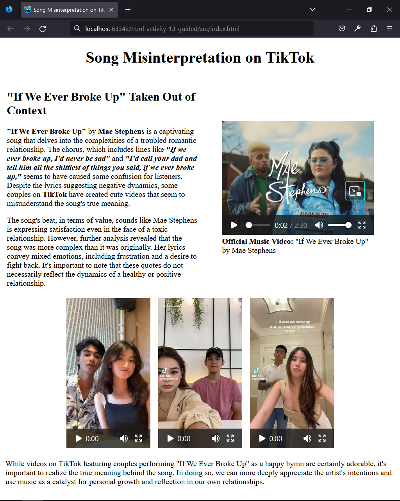
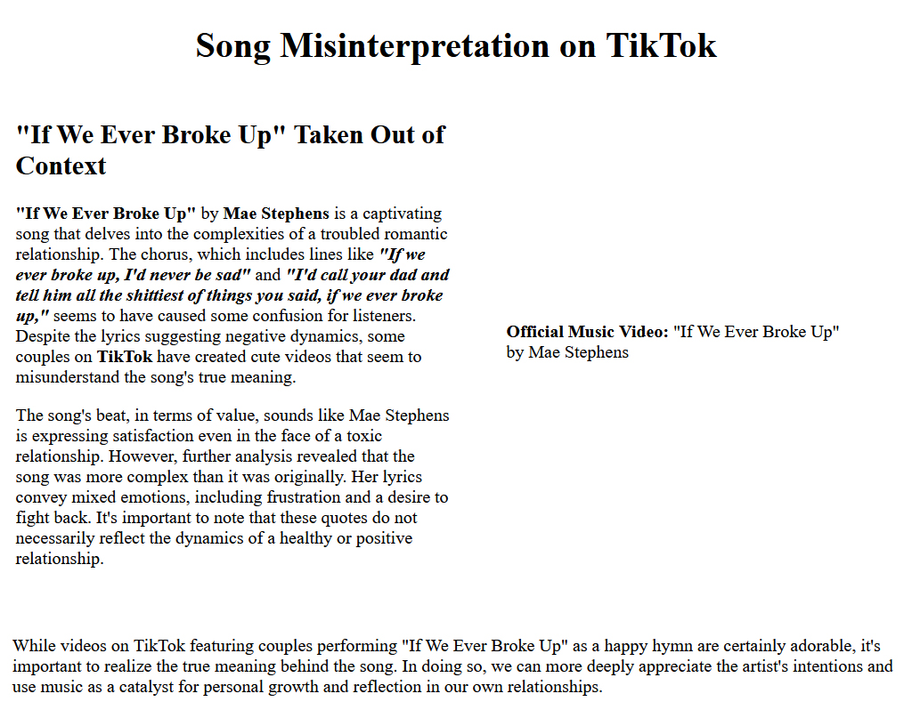

## HTML | Activity #12 (Guided): Video
In this activity, we will create a **Song Review Page** with the following content:




### Development Setup
Create your `index.html` file inside the [**src**](/src) folder in this project,
then follow along with this guide.

To test your output, simply open it in your preferred web browser.


### Template
First, we need a regular HTML template that already contains relevant texts and layout.



We will leave [comments](https://www.w3schools.com/html/html_comments.asp) for the parts that we will do later.

```html
<!DOCTYPE html>
<html lang="en">
<head>
    <meta charset="UTF-8">
    <title>Song Misinterpretation on TikTok</title>
</head>
<body>
    <div class="header" align="center">
        <h1>Song Misinterpretation on TikTok</h1>
    </div>

    <div class="intro">
        <table width="100%" cellpadding="4">
            <tr>
                <td width="50%" valign="top">
                    <h2>"If We Ever Broke Up" Taken Out of Context</h2>
                    <p>
                        <b>"If We Ever Broke Up"</b> by <b>Mae Stephens</b>
                        is a captivating song that delves into the complexities
                        of a troubled romantic relationship.
                        The chorus, which includes lines like
                        <b><i>
                            "If we ever broke up, I'd never be sad"
                        </i></b>
                        and
                        <b><i>
                            "I'd call your dad and tell him all the shittiest
                            of things you said, if we ever broke up,"
                        </i></b>
                        seems to have caused some confusion for listeners.
                        Despite the lyrics suggesting negative dynamics,
                        some couples on <b>TikTok</b> have created cute videos
                        that seem to misunderstand the song's true meaning.
                    </p>
                    <p>
                        The song's beat, in terms of value,
                        sounds like Mae Stephens is expressing satisfaction
                        even in the face of a toxic relationship.
                        However, further analysis revealed that the song was more complex
                        than it was originally.
                        Her lyrics convey mixed emotions,
                        including frustration and a desire to fight back.
                        It's important to note that these quotes
                        do not necessarily reflect the dynamics
                        of a healthy or positive relationship.
                    </p>
                </td>
                <td width="50%">
                    <figure>

                        <!-- Official Music Video -->

                        <figcaption>
                            <b>Official Music Video:</b>
                            "If We Ever Broke Up" by Mae Stephens
                        </figcaption>
                    </figure>
                </td>
            </tr>
        </table>
    </div>

    <div class="tiktok">
        <div align="center">

            <!-- TikTok Video 1 -->
            

            <!-- (spacer) -->
            &nbsp;&nbsp;

            
            
            <!-- TikTok Video 2 -->
            

            
            <!-- (spacer) -->
            &nbsp;&nbsp;
            
            
            <!-- TikTok Video 3 -->

        </div>
    </div>

    <div class="conclusion">
        <table>
            <tr>
                <td>
                    <p>
                        While videos on TikTok featuring couples performing
                        "If We Ever Broke Up" as a happy hymn are certainly adorable,
                        it's important to realize the true meaning behind the song.
                        In doing so, we can more deeply appreciate the artist's intentions
                        and use music as a catalyst
                        for personal growth and reflection in our own relationships.
                    </p>
                </td>
            </tr>
        </table>
    </div>
</body>
</html>
```
